# INCOMING QUALITY IMPLEMENTATION MAP

2026-10-03 · 开发前 Baseline Review · 提交用户确认

**结论：六类业务记录及主链有正式依据，但尚不能判定为可直接完整实施。** 当前代码完成了收货、内部物料批及待验库存阶段；后续来料质量业务未实现。本轮要求中的标准版本实体、复检实例、结果有效性、请求级报告聚合等尚需与正式契约闭合。以下是映射和审查证据，不是新增设计，不授权迁移或实现。

本轮未修改业务代码、SQL、配置、既有冻结发布或开发草案；未连接数据库、执行迁移、编译或运行应用测试。仅形成审查文档及任务索引中的审查记录。依用户要求，确认本映射与审查结果前不进入实际开发。

## 0. 权威、阅读范围与判定规则

正式指针为 [PROJECT_BASELINE](D:/codex/_project/gmp/hospital-pharma-mes/docs/PROJECT_BASELINE.md) 中的 **FINAL BASELINE COMPLETE v1.0.9**。本轮重新校验其 SHA256 清单：**83/83 一致**。读取了根 AGENTS、MES_TASKS、PROJECT_BASELINE，并沿正式指针读取来料相关需求、领域、数据库、状态、API、功能、GxP、UI、测试、RTM、依赖/迁移/集成章节与相关批准增量。

`docs/database/README.md`、`docs/compliance/README.md`、`docs/api/README.md` 本身是占位说明；正式领域设计实际在 `releases/HOSPITAL_PHARMA_MES_V2_FINAL_BASELINE_COMPLETE_v1.0.9/`，没有把 docs 中的空目录误当作设计不存在。docs 下架构、API平台说明、数据库验证策略、相关验收与开发审查材料也已核对；历史计划、概念图、验收截图及未发布候选不覆盖正式设计。

| 来源简称 | 当前正式文件 / 覆盖内容 |
|---|---|
| PRD | `01_PRD_V1.0.9_FROZEN.md`：WMS、来料七项需求、物料政策、QC/OOS/偏差/放行 |
| 架构/领域 | `02_ARCHITECTURE`、`03_DOMAIN_OVERVIEW`、`04_DOMAIN_MODEL_DETAILED`：模块所有权、六记录、Source of Truth、复检及统一资格门禁 |
| DB | `05_DATABASE_DESIGN`：公共PK/元数据、WMS/QMS、样品/结果/放行扩展、审计签名、投料/谱系关联 |
| 状态 | `07_STATE_MACHINE_DETAILED`：来料质量、库存、记录、OOS/复检与后续生产边界 |
| API | `08_API_DETAILED`、完整 OpenAPI、Endpoint Catalog、Interface Guide：主链41条操作及对应schemas；相关旧样品、调查、投料、追溯与平台接口 |
| 功能/UI | `09_FUNCTIONAL_DETAILED`、`10_UI_PAGE_DETAILED`、Route Matrix；UI_MAPPING、DESIGN_SYSTEM、DESIGN_QA、原型HTML及其实际分派脚本；实际查看收货查询和QA放行PNG |
| GxP/验证 | `11_GMP_AUDIT_ESIGNATURE`、12测试清单/详细/覆盖、12A验收、13 RTM、15依赖/迁移/集成矩阵及008A/011/012任务卡 |
| 批准增量 | Incoming DCP、Material Basic/Names、UI List/Edit、007/008 Sequencing 与正式WMS阶段附录；核实此前008A路由/FK批准记录 |

上述简称均指该发布目录的 `V1.0.9` 文件。逐章、逐行阅读证据与完整操作/测试表在三个附件中：

- [A–D 数据/状态审查](D:/codex/_project/gmp/hospital-pharma-mes/docs/development/incoming-review-data.md)
- [E–G API/UI/权限审查](D:/codex/_project/gmp/hospital-pharma-mes/docs/development/incoming-review-api-ui.md)
- [H–J 审计/签名/测试/RTM审查](D:/codex/_project/gmp/hospital-pharma-mes/docs/development/incoming-review-controls-tests.md)

合并判定以本文件为准：正式当前契约、已批准但未发布的变更、本轮用户要求、旧候选设计、实际代码，分别标识。旧 `mes008a-contract.md/.json` 存在错误枚举和未确认映射，**不能直接作为实施契约**。它们保留作历史审查对象，不修改为仿佛早已批准的设计。

## A. 六类正式业务记录 → 需求与业务含义

| 六类记录 | 正式需求 | 主要设计位置 | 必须保持的业务含义 |
|---|---|---|---|
| ① 原辅料收货记录 | WMS-001、MD-MAT-002 | PRD:515–519；领域:137–138；功能:248；正式WMS阶段附录 | 物理接收事实；确认后形成收货明细、内部批、RECEIVE账及快照，初始 QUARANTINE/BLOCKED |
| ② 请验单 | QMS-IN-001 | PRD:523；领域:139；功能:249 | WMS向QC正式交接；关联收货/批/物料/类型及标准版本；不是检验任务或结果 |
| ③ 取样记录 | QMS-SMP-001 | PRD:524；领域:140；功能:250 | SamplingTask管理计划分派，SamplingDetail记录行为，Sample是产生的实体；不得混成一条样品状态 |
| ④ 检验记录 | QMS-TST-001 | PRD:525；领域:141–142；功能:251 | 项目冻结判定依据，执行保存原始事实，结果修订追加保存；复检不覆盖FAIL |
| ⑤ 检验报告 | QMS-RPT-001 | PRD:526；领域:143；功能:252 | 经复核/批准的结果引用汇总；不能手工维护第二套原始结果 |
| ⑥ 物料放行记录 | QMS-MREL-001 | PRD:528–530；领域:144–148；功能:253 | 独立的质量决定；QC PASS不触发物料放行；有效决定与库存可用性受控联动 |

QMS-EXM-001 与 WMS-ELG-001 另覆盖受控免验及统一用料资格。最新流程明确了必验主链，但未给出取消既有免验政策的裁决；本次不自行删除它，也不把“收货完成”实现成可生产。

## B. 六类记录 → 正式数据库表

| 记录 | 正式表名 | 当前仓库状态 |
|---|---|---|
| 收货 | `wms_material_receipt`、`wms_material_receipt_item`；关联 `md_material_lot`、`wms_inventory_ledger` | V013及业务代码已有；本轮未重新检查运行库 |
| 请验 | `qms_inspection_request`、`qms_inspection_request_item` | 正式DB:809有表名；未有对应迁移/业务实现 |
| 取样/样品 | `qms_sampling_task`、`qms_sampling_detail`、`qms_sample` | DB:225–232、798、810；未实现 |
| 检验 | `qms_inspection_task`、`qms_inspection_item`、`qms_test_execution`、`qms_test_result_revision` | DB:563–571、799、811；未实现 |
| 报告 | `qms_inspection_report`、`qms_inspection_report_item` | DB:812；未实现 |
| 放行 | `qms_release_decision`；受控更新批质量/库存状态 | DB:244–252、800；未实现；不得另建MaterialRelease事实表 |

共用 `gxp_audit_event`、`gxp_signature`、平台幂等与集成outbox能力。六类业务记录不限制为六张表，也不意味着可以擅自新增 `qms_sampling_record`、`qms_test_instance`、`qc_specification_version` 等表。后三者是否需要及怎样对应现有模型，须依据正式设计裁决。

## C. PK / FK / 基数与实际关系

所有已规定公共PK为 `id BIGINT AUTO_INCREMENT PRIMARY KEY`；组织隔离及乐观锁按DB公共Profile执行。业务编号不替代PK，物料批号不替代 `material_lot_id`。公共created_by/updated_by为逻辑身份引用，不能未经依据一律改成物理FK。

| 关系 | 正式/当前物理证据 | 审查判断 |
|---|---|---|
| Receipt 1:N ReceiptItem | V013 `receipt_item.receipt_id → receipt.id` | MATCH，实际代码已使用 |
| ReceiptItem → MaterialLot | V013 `lot.receipt_item_id → receipt_item.id` 且该列唯一；正式WMS阶段每明细创建一批 | MATCH；当前不支持任意合并已有批，不能自行增加合批 |
| Lot → Material / Ledger | `lot.material_id → md_material.id`；`ledger.material_lot_id → lot.id` | MATCH，单一批身份及追加库存事实 |
| Request → RequestItem → Lot/Receipt | 正式字段语义及Header/Item表名明确；创建API必填materialLotId | 关联意图MATCH；精确FK/收货一致性必须具体化，不能用候选伪称已冻结 |
| Request → SamplingTask → SamplingDetail → Sample | 领域:140；sample新增sampling_task_id、inspection_request_item_id | 逻辑链MATCH；用户SamplingRecord 1:N Sample在Task/Detail哪层落地未明确，`sampling_detail_id`并非已冻结列名 |
| Sample → TestInstance → TestResult | 正式为 InspectionTask→InspectionItem→TestExecution→TestResultRevision，结果有sample_id、inspection_item_id、test_execution_id | 名称不能直接等同；复检实例/attempt身份及原始FAIL关联是DESIGN GAP，不默认新表或把Revision2当复检 |
| ResultRevision → PreviousRevision | `previous_revision_id`可空FK；唯一 `(inspection_item_id,revision_no)` | MATCH正式不可覆盖谱系，物理实现MISSING |
| ReportItem → approved ResultRevision | 正式领域/功能及API items明确引用具体resultRevisionId | MATCH；报告不能复制维护独立结果。报告根跨Request/Task的覆盖范围待明确 |
| ReleaseDecision → Lot / Report / superseded Decision | DB:800命名相应引用及scope/target约束 | MATCH语义，物理实现MISSING；来料目标仅materialLot，不借成品MainBatch代表来料 |
| Sample/Release → MainBatch | 原FK声明存在，来料值为空；建立真实MainBatch后补FK | 此前008A补齐方案已批准，待累计发布；不重复申请、不提前建临时批表 |
| Release.finished_lot_id → md_material_lot.id | 此前008A补齐已批准的目标澄清 | 仅FINISHED_PRODUCT使用，来料为空；不创建第二套FinishedLot |
| Request → qc_specification_version_id | 当前正式包无此实体/ID生产者及FK定义；旧物料质量规则已退役 | DESIGN GAP；字符串版本或退役物料规则不能假充真实QC标准版本FK |
| MaterialCharge → Lot → 全来料链 | 正式投料/谱系集成要求；MES011当前未实现 | 目标MATCH，真实生产消费及反查MISSING |

下图实线表示当前代码可追溯段，虚线表示正式需求段尚未实现；**不是声称所有表已存在**。TestInstance映射未裁决，因此不画成一张新表。

```mermaid
flowchart LR
  R["Receiving\nreceipt + receipt_item 已实现"] --> L["MaterialLot\nQUARANTINE / BLOCKED 已实现"]
  L -.-> I["InspectionRequest\nrequest + item 未实现"]
  I -.-> S["SamplingRecord\ntask + detail 未实现"]
  S -.-> P["Sample\nqms_sample 未实现"]
  P -.-> T["TestInstance\n与 Task / Item / Execution 映射待确认"]
  T -.-> V["TestResult\nresult_revision 未实现"]
  V -.-> Q["InspectionReport\nreport + item 未实现"]
  Q -.-> D["MaterialRelease\nrelease_decision 未实现"]
  D -.-> A["RELEASED + AVAILABLE\n真实资格门禁未实现"]
  A -.-> C["生产领料 / 称量 / MaterialCharge\n依赖尚未实现"]
  C -. "反向追溯要求" .-> L
```

## D. 正式状态机

| 对象 | 正式状态/转换 |
|---|---|
| 收货记录 | DRAFT → APPROVED，动作confirm；确认后禁止普通编辑 |
| 请验 | DRAFT → SUBMITTED → ACCEPTED → IN_PROGRESS → COMPLETED |
| 取样任务 | PLANNED → ASSIGNED → IN_PROGRESS → COMPLETED |
| 样品 | CREATED → COLLECTED → RECEIVED → IN_TEST → TEST_COMPLETED → RETAINED / DISPOSED |
| 检验任务 | CREATED → ASSIGNED → IN_PROGRESS → PENDING_REVIEW → QC_PASSED / QC_FAILED |
| 检验结果结论 | 正式OpenAPI：PASS / FAIL / INCONCLUSIVE；本轮要求INVALID，不能自行视为INCONCLUSIVE同义词 |
| 检验报告 | DRAFT → REVIEWED → APPROVED；批准内容不能覆写 |
| 必验Lot质量 | QUARANTINE → PENDING_SAMPLING → SAMPLING → SAMPLED → TESTING → PENDING_QC_REVIEW → QC_PASSED → PENDING_QA_RELEASE → RELEASED |
| 异常Lot质量 | TESTING / PENDING_QC_REVIEW → QC_FAILED → PENDING_DISPOSITION → REJECTED，或经批准调查/处置进入PENDING_QA_RELEASE |
| 库存 | BLOCKED → AVAILABLE须有效RELEASED决定；冻结FROZEN及解冻使用受控规则，不删除放行历史 |
| 放行决定 | RELEASED / REJECTED / OTHER_DISPOSITION；决定不可变，变更通过supersedesDecisionId保留谱系 |

正式 `releaseBasis` 为 FULL_INSPECTION / INSPECTION_EXEMPT / RETEST / OTHER_APPROVED_BASIS；`decisionSource` 为 USER_QA / SYSTEM_RULE。旧草案中的 INSPECTION_REPORT 不是此处允许值。

用户提到的LOCKED按现有库存FROZEN及门禁处理；EXPIRED按expiry_date/retest_date门禁处理。因用户已明确以正式字典为准，这两者不构成新增质量枚举的要求。状态只能由命名业务命令驱动；不增加updateStatus或任意PUT status。

## E. API 与 G. 权限

以下列出主链动作；所有路径前缀 `/api/v1`。**逐条method/path/permission/request/response的41条核对表见API/UI附件E节**，不以通配权限代替实际matcher。

| 记录 | 正式接口/动作 | 既有权限 |
|---|---|---|
| 收货 | GET/POST `/wms/receipts`；GET/PUT `/{id}`；POST `/{id}/confirm` | wms:receipt:view/create/update/confirm |
| Lot与门禁 | GET `/wms/material-lots`、`/{id}`、`/{id}/timeline`、`/{id}/eligibility` | wms:inventory:view |
| 请验 | GET/POST `/quality/inspection-requests`；GET `/{id}`；POST `/{id}/submit`、`/{id}/accept` | qms:inspection-request:view/create/submit/accept |
| 取样 | GET/POST `/quality/sampling-tasks`；GET `/{id}`；POST assign/start/details/complete | qms:sampling:view/create/assign/execute/complete |
| 样品 | GET `/quality/samples`、`/{id}`；POST `/{id}/label` | qms:test:view；标签qms:sampling:execute |
| 检验 | GET/POST `/quality/inspection-tasks`；GET `/{id}`；POST assign/start/submit-review/review；POST `/quality/inspection-items/{id}/executions`、`/results`；POST `/quality/test-results/{revisionId}/revisions` | qms:test:view/execute/review/correct，按各动作分别校验 |
| 报告 | GET/POST `/quality/inspection-reports`；GET `/{id}`；POST review/approve | qms:report:view/create/review/approve |
| 放行 | GET `/qa/material-lots/{lotId}/release-review`；POST `/release-decisions` | qa:material-release:view/decide |
| 签名/审计 | POST `/auth/reauth`、`/records/{type}/{id}/sign`；GET `/audit-events` | ebr:sign及对象业务权限；audit:view |

`/samples`旧五项操作归MES012，不能在008A直接启用并绕过SamplingTask/Detail。`/material-charges`、`/trace`属于后续实际生产/谱系契约，不在本轮审查中假造实现。页面按钮可见性不能替代后端权限、组织、状态、版本及签名校验。

普通写入沿用幂等键；已有对象修改沿用If-Match/versionNo和原因；状态/并发冲突409，业务门禁422。GenericRequest可以在正式业务字段范围内具体化，**GenericDTO本身不是全模块阻塞理由**。

## F. 正式UI页面与动作

| 六记录 | List/Query | Create/Execute | View | Review/Approve |
|---|---|---|---|---|
| 收货 | `/wms/receipts` | `/create`、`/:id/edit`及confirm | `/:id` | confirm为收货确认，不是QA放行 |
| 请验 | `/quality/inspection-requests` | `/create`；submit | `/:id` | accept为QC接收 |
| 取样 | `/quality/sampling-tasks` | `/create`、`/:id/execute`；assign/start/details | `/:id` | complete及必要签名 |
| 检验 | `/quality/inspection-tasks` | `/create`、`/:id/execute`；executions/results/revisions | `/:id` | submit-review/review |
| 报告 | `/quality/inspection-reports` | `/create`自动汇总，不手抄结果 | `/:id` | review/approve |
| 放行 | 正式设计使用Lot 360°放行记录入口，无独立decision列表路由 | `/qa/material-lots/:id/release` | `/qa/material-lots/:id/review`及Lot时间线 | 放行/拒绝及签名 |

样品另有 `/quality/samples`、`/:id`，不增加直接创建页。质量工作台 `/quality/workbench` 已由详细UI定义。请验create、取样create/execute、检验create/execute、报告create共六条新增路由，以及工作台映射补齐，**此前已批准、尚待累计发布**，本次不重复请求授权。

布局继续遵守已批准规范：灰底白卡、既有颜色字体间距；桌面查询三列/编辑两列；标签与控件桌面手机均同行（桌面标签130px，手机按正式规范）；List只查询导航、View只读、独立Create/Edit/Execute；状态动作和专用电子签名对话框按现有规范。查询条件保留、409重新加载、422保留输入并定位字段。

原型实读发现：来料页面映射复用收货查询PNG和成品QA放行PNG；原型脚本未实现incoming工作台分支。成品QA图中的eBR、平衡、成品批字段不能复制进来料放行。该复用提供布局参考，**不能证明来料专属表单/列/按钮已全部设计**。缺失之处列为DESIGN GAP，不重新设计整套界面。旧PNG的UNRESOLVED接口/纵向标签已由后续批准覆盖，不再次作为阻断。

## H. Audit / Signature / 历史事实

| 记录 | 审计范围 | 正式签名要求 |
|---|---|---|
| 收货 | 创建、草稿修改、确认、lot及库存事实，操作者/时间/原因/请求/事务 | 不擅增独立人工作业签名点；复用既有确认与审计要求 |
| 请验 | 创建、提交、接收、状态流转与关联标准证据 | 依正式业务签名规则；不把所有写操作自动变成签名 |
| 取样 | 分派、开始、每个取样明细、样品谱系、完成、重取样 | 取样完成签名 |
| 检验 | 执行原始事实、提交结果、复核、更正、复检；原FAIL及先前revision保留 | 结果确认/更正、检验复核、批准处置签名 |
| 报告 | 从确切结果revision生成、复核/批准、受控替代 | 报告批准签名 |
| 放行 | 证据集合、QA决定、放行/拒绝、库存同步、替代、冻结/解冻 | USER_QA放行/拒绝签名；SYSTEM_RULE免验无伪造人工签名 |

平台已具备Audit、签名canonicalizer、对象provider注册、五分钟单次再认证、幂等与事务能力；来料各对象的provider、签名摘要证据集合和消费校验尚未实现。审计存old/new digest，**不能仅凭digest恢复原始值**；业务revision/snapshot必须保留可取回的原始事实，不能向audit塞凭据或完整敏感payload补洞。

静态审查发现一个直接影响后续签名复用的 **SEMANTIC MISMATCH**：`SignatureTransactionService` 显式传入 `revokedSignatureId` 时未验证它是最近一次失效的前驱。可构造S1失效→S2重签再失效→S3仍指定S1的绕链；正式GMP要求关联紧接的失效签名。此项本轮未修复/未跑测试，开发获确认后应做定向修正和回归，不能记为已通过。

## I. 用户六个验收场景与真实验证边界

| 场景 | 原有TC依据 | 尚缺的实际证据 |
|---|---|---|
| 主E2E：收货→待验Lot→请验/QC接收→取样/Sample→全部必检→报告→QA放行→可领料 | TC-WMS-003/008；TC-QMS-IN-001；SMP-001/003；TST-001/003；RPT-001；MREL-002；ELG-001/002 | 真正串联的API/数据库及界面流程；尤其QC接收与正向领料成功，不能由组件测试推断 |
| A QUARANTINE禁止领料 | TC-WMS-001、TC-ELG-001/002 | 真实资格决定及无发料事实；当前无条件DEPENDENCY_NOT_READY不是该用例通过 |
| B QC PASS未QA放行禁止领料 | TC-QMS-MREL-001、TC-ELG-001/002 | QC证据/未放行状态与真实Issue消费；原MREL-001明确测试预留，还需覆盖用户要求的领料 |
| C OOS未处理完成阻断放行 | TC-QMS-003、TC-QMS-MREL-002，偏差相关TC-QMS-002 | 来料OOS/调查/处置真实关联与门禁；缺外部证据不能算PASS |
| D 原FAIL不被复测覆盖 | TC-QMS-TST-001/002、TC-QMS-003 | 原FAIL、批准复检、新实例ID、独立新结果及原结果不变；更正Revision2不能代替复检用例 |
| E MaterialCharge反查完整来料链 | TC-CHG-001/002/003、TC-TRC-001及SMP/TST/RPT/MREL谱系用例 | 真实Charge/Genealogy与全部来料对象；原TRC-001较窄，须明确扩展场景，不能用mock Charge通过 |

同时覆盖权限/组织、状态、标准版本发布后历史冻结、并发冻结、乐观锁、幂等、审计/签名失败回滚、报告引用完整性和历史不覆写。先前WmsIT等PASS仅为历史阶段证据，本轮未重跑、未声称上述六场景通过。

## J. RTM映射与任务依赖

| 需求 | 正式RTM行 | 原有测试映射 | 实现所有权 |
|---|---|---|---|
| WMS-001 | 22、64 | TC-WMS-001及收货/账本003、编辑约束 | MES008 |
| MD-MAT-002 | 49，按Material Basic批准增量解释 | TC-MAT-005、TC-WMS-008 | MES004生产者 / MES008消费 |
| QMS-IN-001 | 51 | TC-QMS-IN-001 | MES008A |
| QMS-SMP-001 | 52 | TC-QMS-SMP-001..003 | MES008A |
| QMS-TST-001 | 53 | TC-QMS-TST-001..003 | MES008A |
| QMS-RPT-001 | 54 | TC-QMS-RPT-001..002 | MES008A |
| QMS-MREL-001 | 55 | TC-QMS-MREL-001..004 | MES008A |
| QMS-EXM-001 | 50 | TC-WMS-006..007 | MES008A |
| WMS-ELG-001 | 56 | TC-ELG-001..004 | MES008A / MES011，MES008亦消费 |
| Audit / Signature | 43、44 | TC-AUD-001/002、TC-SIG-001..003 | MES001平台＋来料对象绑定 |
| OOS/偏差、实际投料与追溯 | 40、34、42及15集成矩阵 | TC-QMS-002/003、TC-CHG-001..003、TC-TRC-001 | 对应MES012 / MES011，与008A的边界需保持 |

008A卡片20项用例与覆盖矩阵17项的差额，是跨任务TC-WMS-008和TC-ELG-003/004，不能删掉也不能假定已通过。完整原TC列表、断言和RTM逐项对应见H–J附件。

MES009/010已被用户纳入此前开发范围，但尚未产出实际批/工序。MES011实际称量投料/谱系和MES012调查仍无实现。本轮不自动扩张后续任务；为完成最终E场景，必须先落实真实生产者和明确来料调查消费契约，不能伪造事实。当前可复用的WMS接收契约足以审查/准备008A，不把009/010的全部争议当成来料模块每一部分的阻塞。

## 1. 现有仓库五类检查结果

| 分类 | 发现及证据 |
|---|---|
| MATCH | WmsService.confirm创建receipt-linked lot，设置QUARANTINE/BLOCKED，追加RECEIVE与审计；V013已定义唯一lot/receipt-item关联、库存追加保护；WmsController/现有页面具备收货与lot阶段；平台签名与审计基础存在。此为源码核对，不是新测试PASS |
| MISSING | QMS/QC/release目前仅pom与package-info；无来料请验/取样/样品/检验/报告/决定业务，无MaterialEligibilityService实现、QMS签名provider、质量路由及完整Lot360；无真实MaterialCharge反向链 |
| UNAUTHORIZED IMPLEMENTATION | 本次检查的来料产品代码范围未发现擅自新增第二套QMS事实、无签名自动QA放行或覆盖FAIL实现。旧候选文档的偏差单列，不误报为已落地代码 |
| SEMANTIC MISMATCH | 平台显式重签前驱校验偏差；旧候选放行basis/result枚举与正式API不同。原型成品QA业务字段不适用于来料QA，但当前并未把该错配实现为来料页面 |
| BASELINE CONFLICT | DB旧signature_id非空与SYSTEM_RULE无人工签名语义的物理一致性尚须补齐；旧用料错误码断言与新统一资格契约文字不一致。部分旧RTM/集成行尚留MaterialVersion或遗漏008A签名消费方，但已有批准增量明确覆盖，不恢复旧行为 |

代码主证据：`backend/mes-wms/.../WmsService.java:108–118`、`WmsController.java:26–48`、`ProductionMaterialGate.java:1–7`、V013:59–174；平台签名审查见H–J附件。当前Issue/Reservation写返回DEPENDENCY_NOT_READY是已批准阶段行为，不能被算作真实放行门禁已经完成。

## 2. DESIGN GAP / BASELINE CONFLICT清单与停止范围

| ID / 分类 | 证据与未闭合点 | 停止的部分；不自行补设计 |
|---|---|---|
| DG-01 DESIGN GAP | 功能:249要求标准/规格版本；正式API仅qualityStandardVersion字符串且无真实标准版本生产者；最新要求创建请验冻结qc_specification_version_id | 标准版本FK、选择/冻结/历史查询及判定快照落库；不得借退役物料规则替代 |
| DG-02 DESIGN GAP | 正式Task/Detail/Sample链存在，TC-SMP-003有TEST_SAMPLE/RETENTION_SAMPLE；复检样、批准其他类型及SamplingRecord层1:N产生规则未闭合 | 样品类型字典及产生基数；不新增凭经验枚举/表，不把留样当检验结果 |
| DG-03 DESIGN GAP | 正式InspectionTask/Item/TestExecution/ResultRevision与用户TestInstance含义未完全对应；批准复检的新实例/attempt及原FAIL链接未定义 | OOS获批复检创建新实例及有效结果选择；禁止以更新FAIL或普通revision替代 |
| DG-04 DESIGN GAP（新要求与冻结字典差异） | 正式OpenAPI:20642–20674为PASS/FAIL/INCONCLUSIVE；用户要求PASS/FAIL/INVALID | INVALID与INCONCLUSIVE的区别、状态/判定/UI/测试；不擅自替换或合并 |
| DG-05 DESIGN GAP（聚合范围差异） | 正式ReportCommand:20675起必填inspectionTaskId和items；用户要求按InspectionRequest汇总多实例 | 同一任务多个execution可兼容；跨任务/样品覆盖、原始与最终结果选择需明确，不能假定已支持或手抄第二套数据 |
| DG-06 DESIGN GAP | 用户要求COA等随货资料；GMP:14提共享Attachment，但收货当前DTO/entity/UI无文件关联；相关上传/访问/保留契约未闭合 | 随货附件关联及证据检索，不把包装检查或任意字符串URL当附件实现 |
| DG-07 DESIGN GAP | 来料OOS/阻断偏差具体Lot/Result/调查/处置关联、可放行条件及业务生产者未闭合；现偏差基础多为MainBatch/Operation | 调查结果消费及可放行处置；缺证据一律阻断，不能自动“调查完成” |
| DG-08 DESIGN GAP | 来料专用UI字段/列/动作覆盖不完整；放行记录未有独立List路由 | 只沿正式已确定布局/页面映射；若要求独立放行List或专用未定义页面，先补正式UI，不增加通用CRUD |
| BC-01 BASELINE CONFLICT（物理表达） | DB:252 signature_id NN；GMP:18明确SYSTEM_RULE不伪造人签 | 同一决策表的免验物理约束须统一。免验无伪签语义已批准，不重复申请该业务决定；不可用假signature行补NN |
| BC-02 BASELINE CONFLICT（陈旧测试断言） | TC-WMS-001 MATERIAL_NOT_RELEASED与后来ELG/PRD MATERIAL_NOT_ELIGIBLE重叠 | 对齐原TC断言与当前统一契约后再开发验证；不在两个接口/测试间悄悄返回不同含义 |
| MM-01 SEMANTIC MISMATCH（现有代码） | 重签允许显式跳过最近失效前驱，见H节 | 现有签名实现定向修正/验证；本轮仅审查，不修改代码 |

不列为新阻塞：已批准的六条质量路由及MainBatch/finishedLot FK补齐；被Material Basic覆盖的MaterialVersion旧语句；被水平标签规范覆盖的旧PNG；GenericDTO或稀疏SQL字段清单本身；LOCKED/EXPIRED概念已有字典表达。旧草案中单task报告根来自正式API，不能误判为草案擅自新增；真正差异是本轮请求级聚合需求尚未闭合。

## 3. 确认后的实施顺序与当前交付状态

按用户指定顺序保留：Database/Flyway → Domain Model → State Machine → Repository/Mapper → Application Service → API → Audit/Signature → UI → Unit Test → Integration Test → End-to-End Flow Test → RTM更新。审计/签名和事务不在早期设计中省略，只是按该顺序落实与验证。所有正式设计变更先同步相关设计并完成一致性审查；执行过的迁移保持不可变。

本轮交付仅为本映射与三个审查附件。**Baseline Review已完成，但结论并非“Baseline无冲突/全部可开发”**。上述冲突/缺口部分暂停，等待用户确认映射及明确相应正式契约；既有批准继续有效。无新增迁移，无新增应用测试PASS，无READY/ACCEPTED状态变更。
